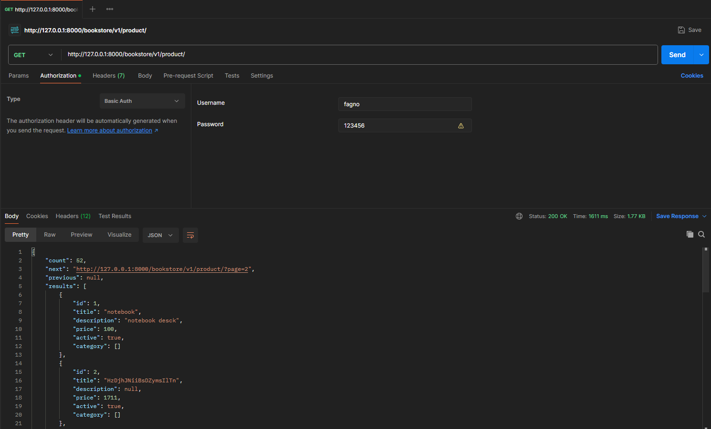
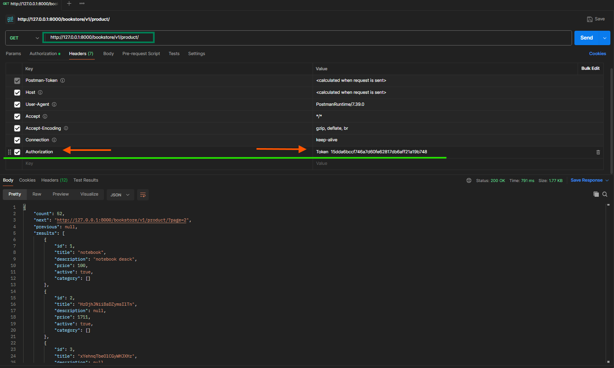
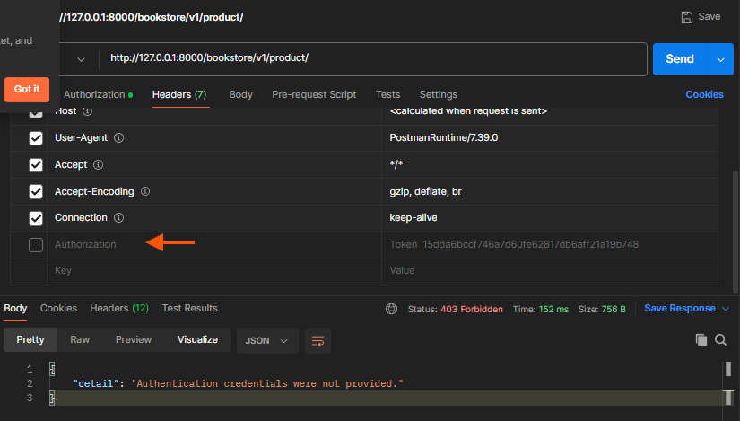
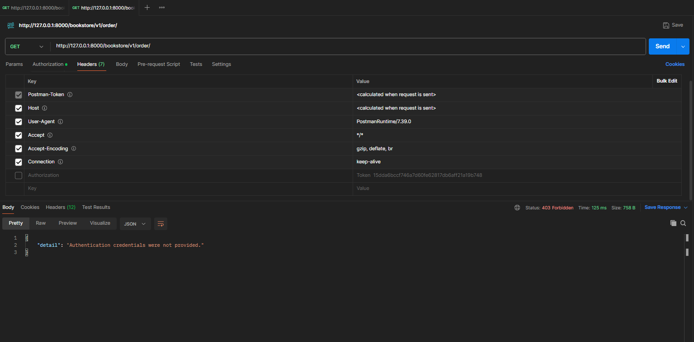
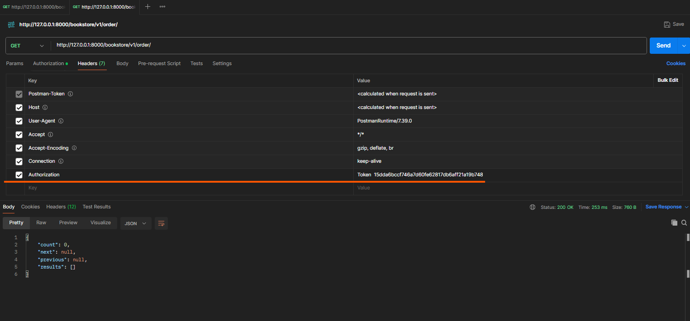

# Bookstore

bookstore app

## criar um anbiente virtual

- 1 verifique as permisoes

```shell
Set-ExecutionPolicy RemoteSigned

```

- bra o PowerShell como administrador.
- Execute o seguinte comando para verificar a política de execução atual:

```shell
Get-ExecutionPolicy
```

- Se a política estiver definida como “Restricted”, você precisará alterá-la para permitir a execução de scripts.
- Para permitir a execução de scripts, execute o seguinte comando:

```shell
Set-ExecutionPolicy RemoteSigned

# S = para [sim]
```

- 2 Crie o abinte vitual

## Criando um anbiente virtual

```shell
python -m venv env

# executar o anbiente virtual
./env\Scripts\activate.ps1

```

## imstalar o poetry dentro do anbiente virtual

```shell
pip install poetry

poetry --version

poetry init

pytest instalado
factory-boy instalado

poetry add django

# fica no mesmo diretorio
poetry run django-admin startproject bookstore .

```

## Rodando Projetos em Django

```shell
poetry run python manage.py startapp api

poetry run python manage.py migrate

# verificar se o serve esta rodando 
poetry run python manage.py runserver

```

## O que é Serializers em Django Rest Framework?

Como integrar Django Models e Django Serializers

```shell
poetry run python manage.py startapp order

poetry run python manage.py startapp product
```

## Migrando Django Models

- declarar os modelos de admin.py de cada aplicativo
- dentro d o ``__init__.py``
- declara os nossos app (product e order) dentro do bookstore project (settings.py)
- deletar os models.py porque ja criamos um diretorio

***comando para gerencia os modulos***

```bash
poetry run python manage.py makemigrations
poetry run python manage.py migrate
```

Criando Serializers em Django
instalar

```bash
poetry add django-rest-framework
```

Criando Serializers em Django

### Resumo Exercício

1 Para o teste app `product`

```bash
python manage.py test order.tests.test_serializers
```

2 Pra o testes do app `order`

```bash
python manage.py test order.tests.test_serializers
```

Nesse exercício vamos construir nossos serializers baseado nos nossos modelos, além disso vamos construir testes unitários para garantir a qualidade dos nosso código.

Crie um PR e envie o link na plataforma da EBAC.

## ViewSets para alteração de dados

### Rotas customizadas em Django Rest Framework

## ViewSets Genericas em Django Rest Framework

```bash
poetry add django-extensions

poetry run python manage.py show_urls

```

## Testando ViewSets com o pacote de teste do Django Rest Framework - Parte 1

```bash
# rodar os testes
poetry run python manage.py test

```

exxercicio

## O Que é Paginação em DRF

- rodar o projeto
  
```bash
poetry run python manage.py runserver
```

## Adicionando dados para paginar

```bash
 poetry run python manage.py shell_plus

from product.factories import ProductFactory
for _ in range(50):
    ProductFactory()

```

## Adicionando Django Toolbar para comparar a paginação do Django

```bash
poetry add django-debug-toolbar
```

## Configurando Paginação do Django Rest Framework

## Token Authentication vs Authentication

- crai um super ususario

```bash
poetry manage.py createsuperuser --user fagno --email fagno@gmail.com
python manage.py createsuperuser --user fagno --email fagno@gmail.com
senha : 123456
```



1 gerar a migracao do token autentication para verificar se a alguma dependencia de migracao

```bash
# executar esse comando 
poetry run python manage.py drf_create_token fagno
# ele gera um token desse usuario
Generated token 15dda6bccf746a7d60fe62817db6aff21a19b748 for user fagno
```



na imagem esta marcado cada alterecao



semo o token

### Testes de segurança em Django Rest Framework

```bash
poetry run python manage.py test
```

Nesse exercício vamos adicionar a autenticação via Token do Django Rest
Framework apenas na nossa ViewSet de Order.


com o tokern


Crie um PR e envie o link na plataforma da EBAC.

git commit -m ":white_check_mark: exercico autenticação via Token"

## Rodando nosso projeto utilizando Dockerfile

```bash
#  contrua nossa imagem no diretorio atual
docker build -t bookstore:latest .

# ver as imagens
docker images 

# executar a imagem sem entrar na imagem
docker run --name bookstore -d -p 8000:8000 bookstore:latest
# esse e orach da imagem 63e2901e54b8435a55f3a4b30d3dc38c2fb1d5e06b8659aa5ff1a4adbaad691c

ver se a imagem esta rodando
```

## Comandos em Docker Compose

```bash
docker run -dit --name alpine1 --network alpine-net alpine ssh
docker network create --driver none ebac-docker-empty

docker run -dit --name alpine3 --network none alpine ssh
bb286aa9ea6a54731801e0f281dce2760cec7c3da0f6a14593dc82269431da5b

docker ps 
lista 

assesar o alpine 
docker container attach alpine3

# Inicie o Contêiner:
# Primeiro, inicie o contêiner que você deseja anexar:
docker start alpine3

# Anexe-se ao Contêiner:
# Após iniciar o contêiner, você pode anexar-se a ele:
docker attach alpine3

docker commit alpine3 minha_nova_imagem_alpine
docker run -it minha_nova_imagem_alpine /bin/sh

docker networck inspect
docker networck ls
docker network inspect <none>

```

## Criando seu primeiro Docker Compose

```bash
docker-compose up --build
poetry install
poetry lock
```

## Como analizar logs e como o Docker Compose funciona internamente

```bash
docker exec -it "o ID 1148bf68e82c   bookstore-web" /bin/bash
# vai para dentro do container 
```

- O Makefile seve com configuracao de setup para instalacao de poacotes e trabalha junto com o readme
- make install

Nesse exercício vamos criar um Dockerfile dentro do nosso projeto do
Django Rest Framework e rodar nosso projeto dentro do Docker, crie uma
branch e um novo PR e após isso envie o link do PR para a plataforma da
EBAC

```bash
docker-compose exec web python manage.py migrate --noinput
```

<!-- git commit -m ":sparkles: feat: Definindo redes com o Docker Compose" -->

## Definindo redes com o Docker Compose

```bash
# listar
docker network ls
# Para obter informações detalhadas sobre uma rede específica, use o comando:
docker network inspect minha-rede

```

## Configurando GitHub Actions


